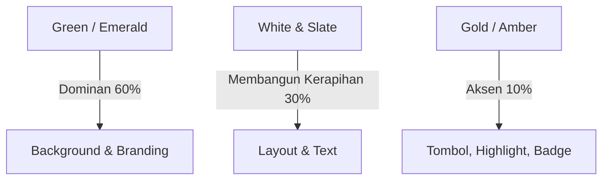

# MASTER DESIGN SYSTEM
## Landing Page Pondok Pesantren (Modern, Trusted, & Professional)

Dokumen ini berisi panduan UI/UX lengkap, sistem desain, panduan tata letak, palet warna, tipografi, serta pola interaksi yang dirancang khusus untuk Landing Page Pondok Pesantren. Sistem ini dibuat agar dapat diimplementasikan menggunakan **React** dan **Tailwind CSS v4** dengan konsisten.

---

## 1. Identitas Brand & Kesan Visual (Vibe)

Tujuan utama landing page ini adalah membangun kepercayaan wali santri dan calon siswa dengan menyeimbangkan nilai-nilai spiritual keagamaan dan profesionalisme akademik modern.

| Aspek | Deskripsi | Pendekatan UI/UX |
| :--- | :--- | :--- |
| **Kesan Utama** | Profesional, Modern, Terpercaya, Islami tapi tidak kaku | Menggunakan layout yang bersih (clean space), bentuk lengkungan modern, dan struktur informasi yang jelas. |
| **Target User** | Wali Santri, Orang Tua (Usia 30–55 tahun), & Calon Santri | Akses navigasi yang mudah, teks dengan keterbacaan tinggi, alur PPDB yang transparan, dan visualisasi aktivitas nyata. |
| **Spiritualitas** | Nuansa Islami yang berorientasi ke masa depan | Mengurangi ornamen dekoratif kaligrafi atau bintang sudut delapan yang terlalu padat. Digantikan dengan geometri abstrak tipis, aksen emas premium, dan tipografi serif klasik yang melambangkan keagungan ilmu. |

---

## 2. Palet Warna (Color Palette)

Palet warna menggunakan kombinasi **Deep Green** (melambangkan kedamaian, pertumbuhan, dan identitas Islami), **Pure/Clean White** (melambangkan kesucian dan modernitas), serta **Prestige Gold** (melambangkan prestasi, kualitas premium, dan warisan nilai).

### A. Kode Warna & Penggunaan



| Nama Warna | CSS Variable (Tailwind v4) | Hex Code | Rekomendasi Penggunaan |
| :--- | :--- | :--- | :--- |
| **Primary (Deep Green)** | `--color-primary` | `#065f46` (Emerald 800) | Header utama, tombol CTA utama, background hero banner sekunder. |
| **Primary Hover** | `--color-primary-hover` | `#047857` (Emerald 700) | State hover pada tombol utama. |
| **Primary Light** | `--color-primary-light` | `#ecfdf5` (Emerald 50) | Background section, highlight card, banner info ringan. |
| **Accent Gold (Classic)** | `--color-gold-500` | `#D4AF37` | Garis pembatas, icon kecil khusus, bintang akreditasi. |
| **Accent Gold (Warm)** | `--color-gold-600` | `#B38F4D` | Teks highlight penting, border tipis card premium. |
| **Accent Gold (Light)**| `--color-gold-50` | `#FAF6EE` | Background card testimoni, highlight banner PPDB. |
| **Neutral White** | `--color-white` | `#FFFFFF` | Background utama halaman, teks di atas background hijau. |
| **Neutral Light** | `--color-slate-50` | `#F8FAFC` | Background section berselang-seling. |
| **Neutral Dark (Text)** | `--color-slate-900` | `#0F172A` | Warna font untuk Heading (h1, h2, h3). |
| **Neutral Body (Text)** | `--color-slate-600` | `#475569` | Warna font untuk deskripsi panjang dan body text. |

---

## 3. Konfigurasi Tailwind CSS v4

Karena proyek ini menggunakan **Tailwind CSS v4** (dengan `@tailwindcss/vite`), konfigurasi dilakukan langsung pada berkas CSS utama (misalnya [index.css](file:///d:/KULIAH\SEMESTER\Kp\project-pesantren\frontend\src\index.css)) di dalam blok `@theme`.

Tambahkan variabel berikut untuk sinkronisasi dengan desain sistem:

```css
@theme {
  /* Font Family Setup */
  --font-sans: 'Inter', sans-serif;
  --font-serif: 'Playfair Display', serif;
  
  /* Brand Color Palette */
  --color-brand-green-dark: #064e3b;   /* Emerald 900 */
  --color-brand-green-main: #065f46;   /* Emerald 800 */
  --color-brand-green-light: #ecfdf5;  /* Emerald 50 */
  
  --color-brand-gold-dark: #85581A;
  --color-brand-gold-main: #B38F4D;
  --color-brand-gold-light: #FAF6EE;
  
  --color-text-title: #0F172A;         /* Slate 900 */
  --color-text-body: #475569;          /* Slate 600 */
  
  /* Key Shadow & Glow Effect */
  --shadow-premium: 0 10px 30px -10px rgba(6, 95, 70, 0.08);
  --shadow-gold-glow: 0 4px 20px rgba(179, 143, 77, 0.15);
}
```

---

## 4. Tipografi (Typography Pairing)

Kombinasi font menggunakan **Serif (Playfair Display)** untuk memberikan kesan prestisius, akademik, dan mapan, dipadukan dengan **Sans-Serif (Inter)** untuk keterbacaan teks body yang optimal di layar digital.

### Skala Tipografi & Penerapan

| Element | Font Family | Size (Mobile / Desktop) | Weight | Line Height | Contoh Penggunaan |
| :--- | :--- | :--- | :--- | :--- | :--- |
| **H1 (Hero Title)** | Playfair Display | `text-3xl` / `text-5xl` | Bold (700) | `leading-tight` | Judul utama di bagian Hero. |
| **H2 (Section Title)** | Playfair Display | `text-2xl` / `text-4xl` | Semi-bold (600) | `leading-snug` | Judul section (Kurikulum, PPDB, dll). |
| **H3 (Card Title)** | Inter | `text-lg` / `text-xl` | Medium (500) | `leading-normal` | Nama program, fasilitas, judul berita. |
| **Body Large** | Inter | `text-base` / `text-lg` | Regular (400) | `leading-relaxed` | Sub-judul Hero atau deskripsi pengantar. |
| **Body Regular** | Inter | `text-sm` / `text-base` | Regular (400) | `leading-relaxed` | Teks artikel, deskripsi program, berita. |
| **Overline/Badge** | Inter | `text-xs` | Bold (700) | Track `tracking-wider` | Label kecil di atas judul (misal: "PROGRAM UNGGULAN"). |

> [!TIP]
> Gunakan kelas `tracking-wide` pada teks body Inter untuk meningkatkan kenyamanan membaca, terutama bagi orang tua wali santri yang berusia lanjut.

---

## 5. Pola Tata Letak & Struktur Halaman (Page Patterns)

Untuk menciptakan alur psikologis yang meyakinkan bagi calon wali santri, susun halaman Landing Page dengan urutan section berikut:

```
[ Hero Section ] ➔ [ Kilas Info / Quick Stats ] ➔ [ Visi & Nilai Utama ] ➔ [ Program Pendidikan ]
        |
[ Kehidupan Boarding ] ➔ [ Alur PPDB & Biaya ] ➔ [ Testimoni Wali Santri ] ➔ [ Footer Terstruktur ]
```

### A. Hero Section (Pintu Gerbang Utama)
*   **Layout**: Tipe split grid (kiri teks, kanan visual/foto interaktif) atau full background image dengan overlay gelap (minimal 50% opacity).
*   **Visual**: Foto santri tersenyum dengan latar belakang gedung pondok yang bersih dan modern. Hindari foto berkualitas rendah (blur) atau stok foto yang tidak realistis.
*   **CTA Action**: Double CTA.
    *   *Primary CTA*: Tombol daftar PPDB (warna Hijau solid atau Hijau dengan border emas tipis).
    *   *Secondary CTA*: Tombol download brosur / tonton video profil (transparan dengan border putih/hijau).

### B. Quick Stats (Section Penegas Kredibilitas)
*   Ditempatkan mengambang (floating) memotong bagian bawah Hero.
*   Berisi angka pencapaian penting: Jumlah Santri Aktif, Jumlah Alumni, Jumlah Pengajar Bersertifikat, dan Tahun Berdiri.
*   *Styling*: Background putih bersih dengan efek `shadow-premium`, berjejer horizontal.

### C. Program Pendidikan & Kurikulum (Sistem Tab / Grid)
*   Memisahkan antara kurikulum kepesantrenan (tahfidz, kitab kuning) dan kurikulum akademik nasional secara modular.
*   *Styling*: Gunakan card modern dengan rounded corner `rounded-2xl`, ikon menggunakan warna emas hangat (`brand-gold-main`).

### D. Alur PPDB (Interactive Timeline)
*   Langkah pendaftaran dibuat linier dari kiri-ke-kanan (di desktop) atau atas-ke-bawah (di mobile).
*   Gunakan indikator lingkaran bernomor dengan garis penghubung warna emas lembut. Langkah yang sedang aktif diberikan efek glow lembut.

---

## 6. Efek Kunci & Mikro-Interaksi (Key Effects & Interactions)

Detail kecil menentukan kelas dari sebuah website. Terapkan efek berikut untuk memberikan kesan eksklusif dan profesional:

### A. Hover State Premium
Untuk tombol dan card interaktif, hindari transisi yang kasar. Gunakan kombinasi `transition-all duration-300 ease-in-out` dengan translasi vertikal:
```html
<!-- Contoh Sintaks Tailwind untuk Hover Card -->
<div class="bg-white p-6 rounded-2xl border border-slate-100 shadow-sm transition-all duration-300 hover:-translate-y-1 hover:shadow-premium">
  <!-- Konten Card -->
</div>
```

### B. Glassmorphism untuk Navigation Bar
Navigasi atas (Navbar) harus tetap melayang saat scroll, namun tidak menghalangi konten di belakangnya secara kaku.
```html
<!-- Contoh Navbar Glassmorphism -->
<nav class="sticky top-0 z-50 bg-white/80 backdrop-blur-md border-b border-slate-100">
  <!-- Konten Navigasi -->
</nav>
```

### C. Aksen Dekoratif Geometris (Subtle Islamic Pattern)
Gunakan pola geometri Islami sebagai latar belakang secara tipis dengan tingkat opacity yang sangat rendah (sekitar 3%–5%) agar tidak mengganggu keterbacaan teks.
*   Gunakan SVG berpola garis tipis.
*   Warna garis: abu-abu muda (`stroke-slate-200`) atau emas tipis (`stroke-brand-gold-main/10`).

---

## 7. Anti-Patterns (Yang Wajib Dihindari)

Untuk memastikan website tidak tampak kuno, amatir, atau tidak terpercaya, hindari hal-hal berikut:

> [!WARNING]
> **1. Hindari Penggunaan Pola Islami yang Terlalu Padat & Berwarna Kontras**
> Pola bintang atau mozaik berwarna tebal di latar belakang teks akan merusak kontras dan keterbacaan (accessibility). Latar belakang teks harus tetap polos atau memiliki gradien sangat lembut.

> [!WARNING]
> **2. Jangan Gunakan Warna Emas Kuning Cerah (Harsh Yellow-Gold)**
> Warna emas yang terlalu kuning terang (`#FFD700`) terlihat murah dan tidak profesional di layar digital. Gunakan warna emas bergradasi perunggu/champagne (`#B38F4D` atau `#C5A880`) untuk nuansa berkelas.

> [!WARNING]
> **3. Jangan Memajang Foto Santri tanpa Izin atau Kualitas Rendah (Blur)**
> Kepercayaan orang tua dibangun dari profesionalisme visual. Foto buram atau bersumber dari pencarian internet acak dapat menurunkan nilai kredibilitas lembaga.

> [!WARNING]
> **4. Hindari Tumpukan Teks (Wall of Text) tanpa Spacing**
> Jangan menggabungkan sejarah panjang pesantren dalam satu paragraf raksasa di halaman depan. Gunakan poin-poin penting, accordion (tanya-jawab), dan tombol "Selengkapnya".

---

## 8. Contoh Implementasi Komponen (React & Tailwind v4)

Berikut adalah contoh implementasi card program unggulan pesantren menggunakan prinsip desain sistem ini:

```jsx
import React from 'react';
import { BookOpen, Star } from 'lucide-react';

export default function ProgramCard({ title, description, category }) {
  return (
    <div className="group relative bg-white p-8 rounded-2xl border border-slate-100 shadow-sm transition-all duration-300 hover:-translate-y-1 hover:shadow-premium overflow-hidden">
      {/* Aksen emas di bagian atas card saat hover */}
      <div className="absolute top-0 left-0 w-full h-[3px] bg-brand-gold-main scale-x-0 transition-transform duration-300 group-hover:scale-x-100" />
      
      <div className="flex items-center justify-between mb-6">
        <div className="p-3 bg-brand-green-light rounded-xl text-brand-green-main transition-colors duration-300 group-hover:bg-brand-green-main group-hover:text-white">
          <BookOpen className="w-6 h-6" />
        </div>
        <span className="text-xs font-bold uppercase tracking-wider text-brand-gold-main bg-brand-gold-light px-3 py-1 rounded-full flex items-center gap-1">
          <Star className="w-3.5 h-3.5 fill-current" />
          {category}
        </span>
      </div>
      
      <h3 className="font-sans text-xl font-semibold text-text-title mb-3 transition-colors duration-300 group-hover:text-brand-green-main">
        {title}
      </h3>
      
      <p className="font-sans text-sm text-text-body leading-relaxed">
        {description}
      </p>
    </div>
  );
}
```

---
*Dokumen ini merupakan acuan utama pembangunan front-end Landing Page Pondok Pesantren. Setiap pengembang wajib mengikuti pedoman warna, tipografi, dan gaya interaksi di atas agar konsistensi visual tetap terjaga.*
